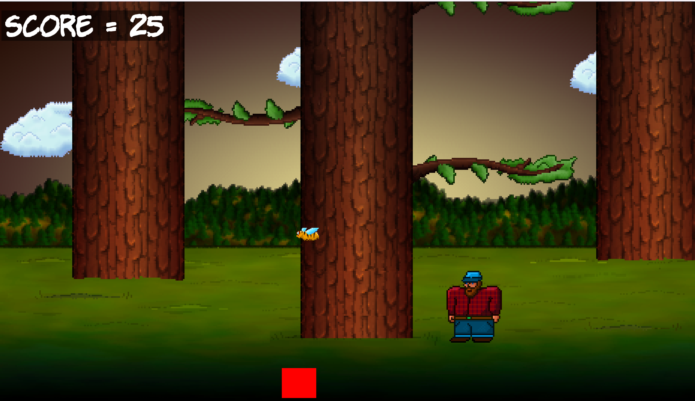

# Timber Man Clone in C++

## Overview

This is a clone of the popular game Timber Man, implemented in C++ using the SFML library. The purpose of this project is to get hands-on experience with C++ through game development.

## Dependencies

- C++11 or higher
- SFML 2.5 or higher
- 

